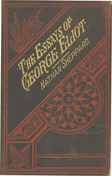

# The Essays of "George Eliot": Complete <kbd>28289</kbd>

## Authors

 - Eliot, George <small>(1819 - 1880)</small>

## Subjects

 - Literature -- History and criticism

## Download

 - https://www.gutenberg.org/ebooks/28289.html.images
 - https://www.gutenberg.org/files/28289/28289.zip
 - https://www.gutenberg.org/files/28289/28289-h.zip
 - https://www.gutenberg.org/files/28289/28289-0.zip
 - https://www.gutenberg.org/cache/epub/28289/pg28289.cover.small.jpg
 - https://www.gutenberg.org/ebooks/28289.epub.images
 - https://www.gutenberg.org/ebooks/28289.rdf
 - https://www.gutenberg.org/ebooks/28289.kindle.images

## Book Shelves

