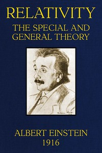

# Relativity: The Special and General Theory <kbd>30155</kbd>

## Authors

 - Einstein, Albert <small>(1879 - 1955)</small>

## Subjects

 - Relativity (Physics)

## Download

 - https://www.gutenberg.org/files/30155/30155-doc.doc
 - https://www.gutenberg.org/files/30155/30155-0.zip
 - https://www.gutenberg.org/files/30155/30155-doc.zip
 - https://www.gutenberg.org/files/30155/30155-pdf.pdf
 - https://www.gutenberg.org/files/30155/30155-h/30155-h.htm
 - https://www.gutenberg.org/cache/epub/30155/pg30155.cover.small.jpg
 - https://www.gutenberg.org/ebooks/30155.html.images
 - https://www.gutenberg.org/ebooks/30155.epub.images
 - https://www.gutenberg.org/ebooks/30155.rdf
 - https://www.gutenberg.org/ebooks/30155.kindle.images
 - https://www.gutenberg.org/files/30155/30155-readme.txt

## Book Shelves

 - Physics
