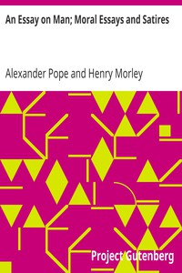

# An Essay on Man; Moral Essays and Satires <kbd>2428</kbd>

## Authors

 - Pope, Alexander <small>(1688 - 1744)</small>

## Subjects

 - English poetry -- 18th century

## Download

 - https://www.gutenberg.org/files/2428/2428.txt
 - https://www.gutenberg.org/ebooks/2428.html.images
 - https://www.gutenberg.org/files/2428/2428-h.zip
 - https://www.gutenberg.org/cache/epub/2428/pg2428.cover.small.jpg
 - https://www.gutenberg.org/ebooks/2428.rdf
 - https://www.gutenberg.org/ebooks/2428.epub.images
 - https://www.gutenberg.org/ebooks/2428.kindle.images
 - https://www.gutenberg.org/ebooks/2428.txt.utf-8

## Book Shelves

