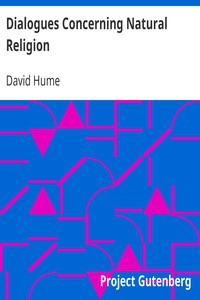

# Dialogues Concerning Natural Religion <kbd>4583</kbd>

## Authors

 - Hume, David <small>(1711 - 1776)</small>

## Subjects

 - Natural theology -- Early works to 1800
 - Religion -- Early works to 1800

## Download

 - https://www.gutenberg.org/files/4583/4583-h/4583-h.htm
 - https://www.gutenberg.org/cache/epub/4583/pg4583.cover.small.jpg
 - https://www.gutenberg.org/ebooks/4583.html.images
 - https://www.gutenberg.org/ebooks/4583.kindle.images
 - https://www.gutenberg.org/ebooks/4583.epub.images
 - https://www.gutenberg.org/files/4583/4583.txt
 - https://www.gutenberg.org/ebooks/4583.txt.utf-8
 - https://www.gutenberg.org/ebooks/4583.rdf

## Book Shelves

 - Paganism
 - Philosophy
