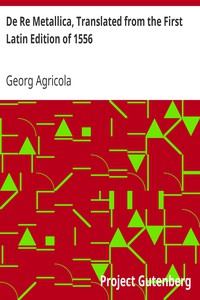

# De Re Metallica, Translated from the First Latin Edition of 1556 <kbd>38015</kbd>

## Authors

 - Agricola, Georg <small>(1494 - 1555)</small>

## Subjects

 - Metallurgy -- Early works to 1800
 - Mineral industries -- Early works to 1800
 - Paleontology -- Early works to 1800
 - Zoology -- Pre-Linnaean works

## Download

 - https://www.gutenberg.org/files/38015/38015-h.zip
 - https://www.gutenberg.org/files/38015/38015.zip
 - https://www.gutenberg.org/cache/epub/38015/pg38015.cover.small.jpg
 - https://www.gutenberg.org/files/38015/38015-8.txt
 - https://www.gutenberg.org/ebooks/38015.html.images
 - https://www.gutenberg.org/files/38015/38015-h/38015-h.htm
 - https://www.gutenberg.org/ebooks/38015.txt.utf-8
 - https://www.gutenberg.org/ebooks/38015.epub.images
 - https://www.gutenberg.org/ebooks/38015.rdf
 - https://www.gutenberg.org/ebooks/38015.kindle.images

## Book Shelves

