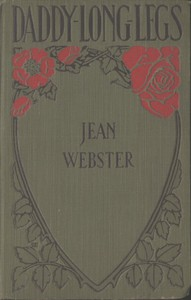

# Daddy Long-Legs: A Comedy in Four Acts <kbd>40426</kbd>

## Authors

 - Webster, Jean <small>(1876 - 1916)</small>

## Subjects

 - Comedies
 - Orphans -- Drama
 - Philanthropists -- Drama
 - Women authors -- Drama
 - Women college students -- Drama
 - Young women -- Drama

## Download

 - https://www.gutenberg.org/cache/epub/40426/pg40426.cover.small.jpg
 - https://www.gutenberg.org/files/40426/40426-0.txt
 - https://www.gutenberg.org/files/40426/40426-0.zip
 - https://www.gutenberg.org/files/40426/40426-8.zip
 - https://www.gutenberg.org/ebooks/40426.html.images
 - https://www.gutenberg.org/files/40426/40426-h/40426-h.htm
 - https://www.gutenberg.org/ebooks/40426.rdf
 - https://www.gutenberg.org/ebooks/40426.kindle.images
 - https://www.gutenberg.org/files/40426/40426.txt
 - https://www.gutenberg.org/ebooks/40426.epub.images

## Book Shelves

