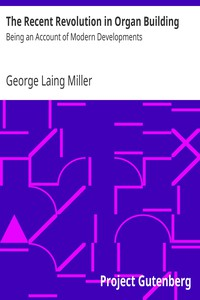

# The Recent Revolution in Organ Building: Being an Account of Modern Developments <kbd>21204</kbd>

## Authors

 - Miller, George Laing <small>(null - null)</small>

## Subjects

 - Organ (Musical instrument) -- Construction

## Download

 - https://www.gutenberg.org/files/21204/21204.zip
 - https://www.gutenberg.org/cache/epub/21204/pg21204.cover.medium.jpg
 - https://www.gutenberg.org/files/21204/21204-h.zip
 - https://www.gutenberg.org/files/21204/21204-8.zip
 - https://www.gutenberg.org/ebooks/21204.html.images
 - https://www.gutenberg.org/ebooks/21204.kindle.images
 - https://www.gutenberg.org/ebooks/21204.rdf
 - https://www.gutenberg.org/ebooks/21204.txt.utf-8
 - https://www.gutenberg.org/ebooks/21204.epub.images

## Book Shelves

