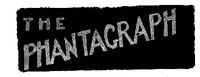

# The Hyborian Age <kbd>42182</kbd>

## Authors

 - Howard, Robert E. (Robert Ervin) <small>(1906 - 1936)</small>

## Subjects

 - Conan (Fictitious character) -- Fiction
 - Fantasy fiction, American

## Download

 - https://www.gutenberg.org/files/42182/42182-h/42182-h.htm
 - https://www.gutenberg.org/files/42182/42182-8.zip
 - https://www.gutenberg.org/cache/epub/42182/pg42182.cover.medium.jpg
 - https://www.gutenberg.org/files/42182/42182.txt
 - https://www.gutenberg.org/ebooks/42182.html.images
 - https://www.gutenberg.org/ebooks/42182.rdf
 - https://www.gutenberg.org/ebooks/42182.kindle.images
 - https://www.gutenberg.org/ebooks/42182.txt.utf-8
 - https://www.gutenberg.org/ebooks/42182.epub.images

## Book Shelves

 - Science Fiction
