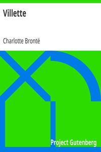

# Villette <kbd>9182</kbd>

## Authors

 - Brontë, Charlotte <small>(1816 - 1855)</small>

## Subjects

 - Autobiographical fiction
 - British -- Belgium -- Fiction
 - Brussels (Belgium) -- Fiction
 - Love stories
 - Women teachers -- Fiction

## Download

 - https://www.gutenberg.org/files/9182/9182-0.txt
 - https://www.gutenberg.org/files/9182/9182-0.zip
 - https://www.gutenberg.org/cache/epub/9182/pg9182.cover.small.jpg
 - https://www.gutenberg.org/files/9182/9182-h/9182-h.htm
 - https://www.gutenberg.org/files/9182/9182-8.txt
 - https://www.gutenberg.org/files/9182/9182.txt
 - https://www.gutenberg.org/ebooks/9182.html.images
 - https://www.gutenberg.org/ebooks/9182.rdf
 - https://www.gutenberg.org/ebooks/9182.epub.images
 - https://www.gutenberg.org/ebooks/9182.kindle.images

## Book Shelves

