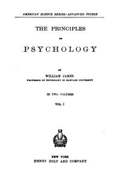

# The Principles of Psychology, Volume 1 (of 2) <kbd>57628</kbd>

## Authors

 - James, William <small>(1842 - 1910)</small>

## Subjects

 - Psychology

## Download

 - https://www.gutenberg.org/files/57628/57628-0.zip
 - https://www.gutenberg.org/files/57628/57628-h/57628-h.htm
 - https://www.gutenberg.org/cache/epub/57628/pg57628.cover.small.jpg
 - https://www.gutenberg.org/files/57628/57628-0.txt
 - https://www.gutenberg.org/ebooks/57628.html.images
 - https://www.gutenberg.org/ebooks/57628.epub.images
 - https://www.gutenberg.org/ebooks/57628.rdf
 - https://www.gutenberg.org/ebooks/57628.kindle.images

## Book Shelves

