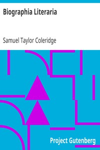

# Biographia Literaria <kbd>6081</kbd>

## Authors

 - Coleridge, Samuel Taylor <small>(1772 - 1834)</small>

## Subjects

 - Aesthetics
 - Criticism
 - Poetry
 - Wordsworth, William, 1770-1850. Lyrical ballads

## Download

 - https://www.gutenberg.org/files/6081/6081-h/6081-h.htm
 - https://www.gutenberg.org/files/6081/6081-h.zip
 - https://www.gutenberg.org/cache/epub/6081/pg6081.cover.medium.jpg
 - https://www.gutenberg.org/files/6081/6081.zip
 - https://www.gutenberg.org/ebooks/6081.html.images
 - https://www.gutenberg.org/ebooks/6081.rdf
 - https://www.gutenberg.org/ebooks/6081.kindle.images
 - https://www.gutenberg.org/ebooks/6081.epub.images
 - https://www.gutenberg.org/ebooks/6081.txt.utf-8

## Book Shelves

