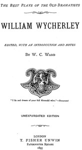

# William Wycherley [Four Plays] <kbd>55426</kbd>

## Authors

 - Wycherley, William <small>(1640 - 1716)</small>

## Subjects

 - English drama (Comedy)
 - English drama -- 17th century

## Download

 - https://www.gutenberg.org/files/55426/55426-0.zip
 - https://www.gutenberg.org/files/55426/55426-h.zip
 - https://www.gutenberg.org/cache/epub/55426/pg55426.cover.medium.jpg
 - https://www.gutenberg.org/ebooks/55426.html.images
 - https://www.gutenberg.org/ebooks/55426.rdf
 - https://www.gutenberg.org/ebooks/55426.kindle.images
 - https://www.gutenberg.org/ebooks/55426.epub.images

## Book Shelves

