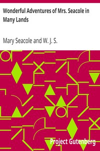

# Wonderful Adventures of Mrs. Seacole in Many Lands <kbd>23031</kbd>

## Authors

 - Seacole, Mary <small>(1805 - 1881)</small>

## Subjects

 - Crimean War, 1853-1856 -- Personal narratives, Jamaican
 - Seacole, Mary, 1805-1881 -- Travel -- Ukraine -- Crimea
 - Women, Black -- Jamaica -- Biography

## Download

 - https://www.gutenberg.org/files/23031/23031-h.zip
 - https://www.gutenberg.org/files/23031/23031-8.txt
 - https://www.gutenberg.org/files/23031/23031.txt
 - https://www.gutenberg.org/cache/epub/23031/pg23031.cover.medium.jpg
 - https://www.gutenberg.org/ebooks/23031.html.images
 - https://www.gutenberg.org/ebooks/23031.txt.utf-8
 - https://www.gutenberg.org/ebooks/23031.epub.images
 - https://www.gutenberg.org/ebooks/23031.kindle.images
 - https://www.gutenberg.org/ebooks/23031.rdf

## Book Shelves

 - Women's Travel Journals
