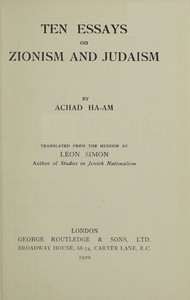

# Ten Essays on Zionism and Judaism <kbd>67667</kbd>

## Authors

 - Ahad Ha'am <small>(1856 - 1927)</small>

## Subjects

 - Jews -- Restoration
 - Judaism
 - Zionism

## Download

 - https://www.gutenberg.org/ebooks/67667.kindle.images
 - https://www.gutenberg.org/ebooks/67667.txt.utf-8
 - https://www.gutenberg.org/cache/epub/67667/pg67667.cover.small.jpg
 - https://www.gutenberg.org/ebooks/67667.rdf
 - https://www.gutenberg.org/ebooks/67667.epub.images
 - https://www.gutenberg.org/files/67667/67667-0.txt
 - https://www.gutenberg.org/files/67667/67667-h/67667-h.htm
 - https://www.gutenberg.org/files/67667/67667-0.zip

## Book Shelves

